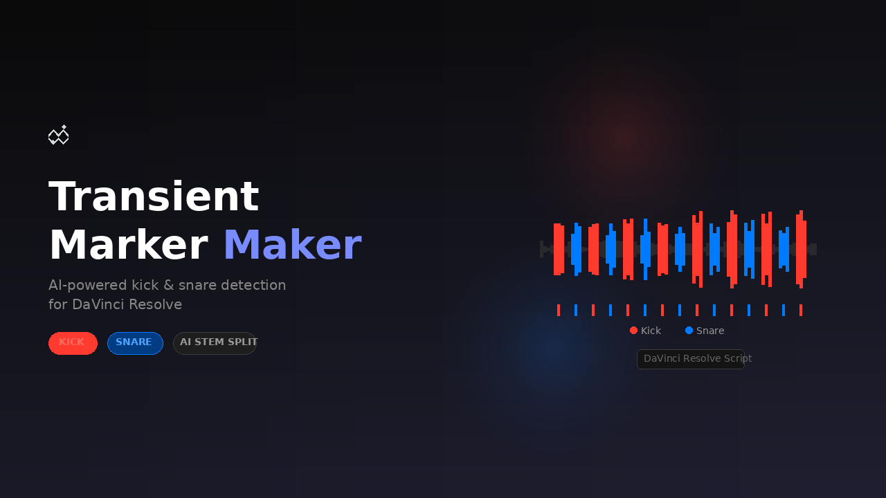

# Transient Marker Maker

AI-powered kick & snare detection for DaVinci Resolve. Automatically separates drums from any audio file using Meta's Demucs, detects kick and snare transients, and places color-coded markers directly on clips in your timeline.

- **Red markers** = Kick
- **Blue markers** = Snare
- Colors and sensitivity are fully configurable

Works on **Windows** and **macOS**. Runs from inside Resolve (Workspace > Scripts) or as a standalone window.



## How It Works

1. **Demucs** (by Meta) separates the drum stem from the mix
2. The drum stem is split into frequency bands — kick (20–120 Hz), snare (200–5000 Hz)
3. Energy-based onset detection finds transient peaks
4. Overlapping hits are deduplicated
5. Markers are placed on the matching clip in Resolve

## Requirements

- DaVinci Resolve 18+ (Free or Studio)
- Python 3.10+
- NVIDIA GPU recommended on Windows (CPU works too)
- Apple Silicon Macs run Demucs natively on GPU

## Quick Install

### Windows

Double-click `install.bat`, or manually:

```
pip install numpy scipy soundfile demucs
pip install torch torchaudio --index-url https://download.pytorch.org/whl/cu121
```

### macOS

Run `chmod +x install.sh && ./install.sh`, or manually:

```
pip3 install numpy scipy soundfile demucs torch torchaudio
```

Then enable scripting in Resolve: **Preferences > General > External scripting using > Local**

The installer copies the script to Resolve's Utility scripts folder automatically.

## Usage

**From inside Resolve:** Workspace > Scripts > Transient Marker Maker

**From terminal:** `python "Transient Marker Maker.py"` (Resolve must be running)

Both modes open a UI with file picker, sensitivity sliders, color pickers, and marker controls.

## Sensitivity

- Lower (toward 0) = more markers (catches quieter hits)
- Higher (toward 1) = fewer markers (only prominent hits)
- Default: 0.55 for both kick and snare

## Troubleshooting

See [README.txt](README.txt) for detailed troubleshooting steps covering common issues like torch version conflicts, missing modules, and script visibility in Resolve.

## License

MIT
